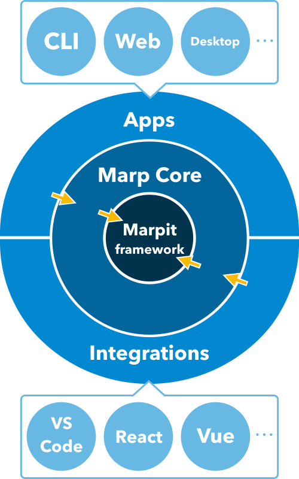

# Contributing to Marp project

Thank you for taking the time to read how to contribute to our project! This is the basic guideline for contributing to [Marp team owned projects][marp-team].

You can start contributing our project in several ways: improve docs, report bug, request feature, writing code, and so on.

Depending on the project you want to contribute, it might have additional guidelines you should follow at that repository. Please also check the guideline per repository.

> :information_source: Would you the first time to contribute OSS? [Open Source Guides](https://opensource.guide/how-to-contribute/) might help you.

## [Code of conduct][code-of-conduct]

We follow [Contributor Covenant Code of Conduct][code-of-conduct] in the all of repositories managed by [marp-team].

## Architecture

[](architecture.svg)

A figure on the left shows the whole of architecture in the Marp ecosystem. Yellow arrows are meaning dependency.

**[Marpit]** is the center of the ecosystem and the independent framework for developers. It's designed suitable for not only Marp but also other slide libraries (See examples of collaboration with [reveal.js](https://codesandbox.io/nw80vrxvpp) and [WebSlides](https://codesandbox.io/j3wo2091yw)).

You are probably using **[Marp Core]** if you are creating a slide deck with Marp. It includes built-in themes, settings that suit for Marp tools, and Markdown extensions that break CommonMark.

And the most of Marp apps (CLI, Web, Desktop...) and integrations (VS Code, React, Vue...) are creating based on [Marp Core]. [Marp CLI](https://github.com/marp-team/marp-cli) is a precious exception that supports Marpit-based converter for power users.<br clear="all" />

[marpit]: https://github.com/marp-team/marpit
[marp core]: https://github.com/marp-team/marp-core

## Report issue

At first, you should search for similar issues before reporting your issue. It may have already been discussed or resolved in the other issue.

[:mag: `org:marp-team is:issue [keyword]`](https://github.com/search?q=org%3Amarp-team+is%3Aissue+%5Bkeyword%5D) is useful to search issue from across our projects.

If you could not find out a similar issue, you can create a new issue. Please not contain multiple reports into one issue. It should have only one theme.

> :information_source: Some projects have consisted of [marp-team] owned packages based on [project architecture](#architecture). If you know which project causes an issue, please report the issue to that repository. The member of Marp team may [transfer the reported issue](https://help.github.com/en/articles/transferring-an-issue-to-another-repository) into the proper repository.

### Question

Keep in mind that **GitHub issue tracker is not a support forum.** _You should not expect an answer to such a question at GitHub._ You can use [StackOverflow](https://stackoverflow.com/) if you want.

### Feature request

Feature request is welcome because it could give feedback to us.

However, we have to take a moment to judge whether fitting to the project aim and scope. We require clear benefit and strong incentive to work for the request because each our projects should keep simple and smart. A created issue would serve as a table for discussion.

### Bug report

> :warning: Did you find a security vulnerability? _Report directly to security@marp.app instead of opening a new issue._

Currently, we don't have a default issue template. But to assist in finding the bug by committer rapidly, it is good to describe these:

- Expected behavior and actual behavior
- Necessary steps and resources to reproduce bug
- Occurred environment (e.g. the version of OS, browser, Node.js, and so on)

## Pull request

You can submit pull request if you have fixed or added useful something to our projects.

- **Indicate related issue(s) in description of PR.** In many cases, the created PR should already have related problems. GitHub can [close issue automatically by keyword](https://help.github.com/articles/closing-issues-using-keywords/).

- **Keep code styling.** We are using [yarn] package manager, [Prettier] formatter, and linters for each language. CI build would fail when using the wrong format/style. It could fix by `yarn format --write` and `yarn lint:[lang] --fix` in most projects.

- **Maintain tests.** We need to fill code coverage by writing meaningful tests. In many projects, we are setting a threshold of global line coverage to 95%. You could measure coverage in local by running `yarn test:coverage`.

### For maintainer

These are tasks for maintainer, and usually committer doesn't have to worry.

- If there is CHANGELOG.md in a working project, the maintainer has to update it after (or while) merge PR. We're adopting the format based on [Keep a Changelog].

## Release

The core maintainer can release package or product of marp-team projects.

> :warning: You have to use `npm` in a release process, and NEVER use `yarn`.

### Versioning

Basically we are following [Semantic Versioning].

#### Pre-release

We treat `v0.0.x` as the pre-release version. Against the spec of semver, it may update only patch version until reach to the stable implementation even if it has some breakings or incompatible changes.

Maintainer should mark `v0.0.x` as "Pre-release" in GitHub release page.

#### Bump version

We have automated bumping version with `version` npm script in many repositories.

If it is defined in `package.json`, run `npm version [major|minor|patch]` at latest `master` branch to bump version. In many cases, it would add the version tag and update CHANGELOG.md.

After than, push master branch and tag by `git push && git push --tags`. Please update GitHub release by taking copy of change logs from updated CHANGELOG.md if possible.

### Publish to npm

Several repository provide [npm package](https://www.npmjs.com/org/marp-team). The core maintainer can publish package to npm after bumping version.

```
npm publish
```

For the security reason, we are not planned to automate publishing. [We require two-factor authentication to publish](https://blog.npmjs.org/post/175861857230/two-factor-authentication-protection-for-packages).

> :information_source: Maintainer should configure to check code styling and tests again when running important commands through `preversion` (bumping version) and `prepack` (publish to npm).

[code-of-conduct]: https://github.com/marp-team/marp/blob/master/.github/CODE_OF_CONDUCT.md
[marp-team]: https://github.com/marp-team/
[yarn]: https://yarnpkg.com/
[prettier]: https://prettier.io/
[keep a changelog]: https://keepachangelog.com/en/1.0.0/
[semantic versioning]: https://semver.org/
