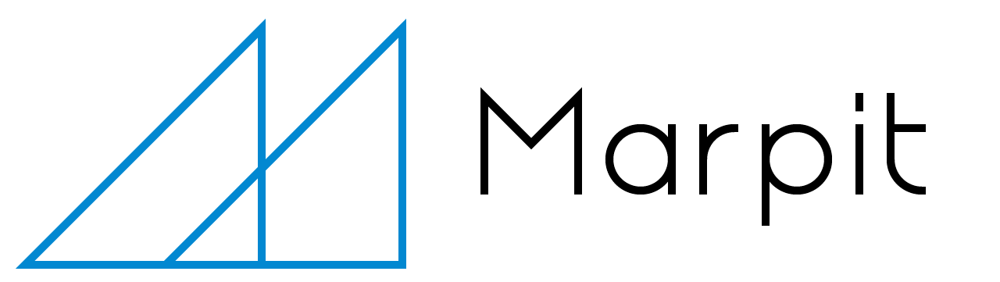

<!---->

The first version of [Marp](https://yhatt.github.io/marp/) was released at almost 3 years ago. At first, it was started from a simple tool for personal usage called "mdSlide". And now, Marp has been used by a lot of users who would recognize the real value of the presentation writer. Marp is amassed over [7,400 stars](https://github.com/yhatt/marp/stargazers) until now.

However, our headache came from lacked maintainability to develop. We must evolve to keep providing the best writing environment of presentation deck.

Today, I'm so excited to introduce the story of Marp Next! The full-rewritten Marp is not only just a writer. To be usable in various situations, we built **a brand-new Marp ecosystem** consisted of multiple modules. They are developed with JavaScript and TypeScript, and much more maintainable than the previous Marp.

<!-- more -->

## Marpit

**[Marpit]** is skinny framework for creating slide deck from Markdown. It is designed to output only minimum assets consisted of static HTML and CSS, and the output can convert into PDF slide deck by printing.

- Keep compatibllity with a plain Markdown document (Marpit Markdown)
- Easy to create theme CSS by clean markup (Theme CSS)
- No required JavaScript for presentation (Inline SVG slide)

[marpit]: https://marpit.marp.app/

## Marp Core

## Marp CLI

## Marp Web
